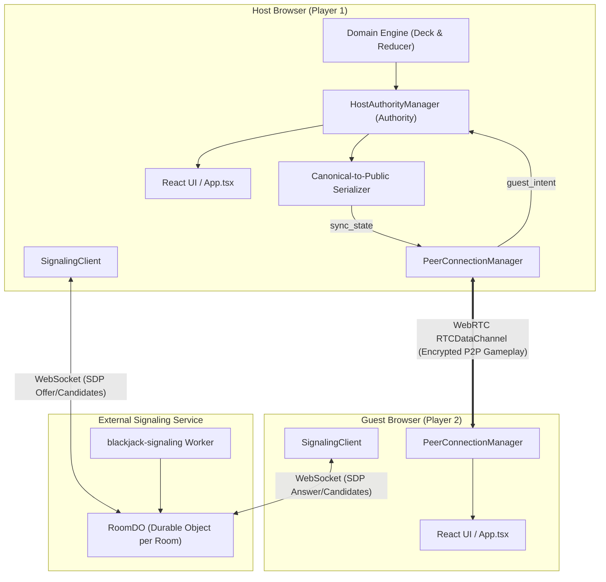

# Architecture

Blackjack is a browser-first React application built with TypeScript and Vite. It provides local modes (BOT and Two Players) and an Online P2P multiplayer mode using native WebRTC DataChannels and an ephemeral Cloudflare Worker Durable Object signaling service.

## System Topology

## Presentation Layer

`src/App.tsx` owns screen composition, mode switching (`bot`, `local`, `online`), lobby UX (Create Room, Join Room with short codes), scoreboard presentation, keyboard shortcuts, rules dialog, and feedback banners. Reusable game elements are encapsulated in `PlayerPanel`, `DealerStation`, `PlayingCard`, and `RulesModal`.

## Game State & Domain Rules

- `src/lib/game-logic.ts` & `src/lib/deck.ts`: Pure domain logic for card representation, deck creation, dynamic Ace valuation (1 or 11), hand scoring, and dealer comparison.
- `src/hooks/useBlackjackGame.ts`: Reducer-driven state machine for local modes, controlling turns, dealer autoplay, 30-second timer, and isolated scoreboards.

## Online P2P Subsystem

The online multiplayer system is split into distinct architectural layers:

1. **Signaling Transport (`src/lib/online/signaling.ts`)**:
   - Manages WebSocket connection to the Cloudflare Worker signaling URL (`VITE_SIGNALING_URL`).
   - Handles room creation (`?intent=create`) and join (`?intent=join`).
   - Exchanges WebRTC offer, answer, and ICE candidate frames.
   - Implements heartbeat ping/pong and connection error handling.

2. **Peer Connection Lifecycle (`src/lib/online/peer.ts`)**:
   - Manages `RTCPeerConnection` configuration (Google STUN default).
   - Host initiates negotiation and creates the reliable ordered `RTCDataChannel` (`blackjack-game`).
   - Guest listens for `ondatachannel` and accepts incoming connection.
   - Emits connected, disconnected, error, and message lifecycle events.

3. **Authority & Validation (`src/lib/online/authority.ts`)**:
   - `HostAuthorityManager` runs exclusively in the Host tab.
   - Host acts as the sole game authority, maintaining the canonical `GameState`.
   - Gating: Dealing a round requires mutual player readiness (`hostReady` and `guestReady`).
   - Intent Validation: Guest actions (`hit`, `stand`, `ready`, `rematch`) are validated against current phase, turn (`p2-turn`), score limits, and strict schema.

4. **Information Hiding Serializer (`src/lib/online/serializer.ts`)**:
   - `serializeCanonicalToPublic` projects internal `GameState` into `PublicGameState`.
   - Masks the Dealer's hole card as `{ label: '?', value: 0, isHidden: true }` until dealer reveal phase.
   - Completely omits undealt deck cards, deck order, and RNG metadata from network payloads.

5. **Typed Versioned Protocol (`src/lib/online/types.ts`)**:
   - Enforces `PROTOCOL_VERSION = 1` across all messages.
   - `GuestIntentMessage`: `{ type: 'guest_intent', version: 1, action, value? }`.
   - `HostMessage`: `{ type: 'sync_state', version: 1, state }` or `{ type: 'action_rejected', version: 1, reason }`.
   - Strict runtime typeguards reject malformed frames or payloads with unknown extra fields.

6. **External Signaling Service ([`blackjack-signaling`](https://github.com/LeoneMarcos/blackjack-signaling))**:
   - Deployed independently as a Cloudflare Worker with one Durable Object (`RoomDO`) per room.
   - Owns room allocation, peer limits, signaling schema validation, and offer/answer direction checks.
   - Relays WebRTC negotiation only; Blackjack gameplay remains peer-to-peer over the DataChannel.
   - No Worker source, Wrangler dependency, or Durable Object configuration lives in this frontend repository.

## Quality Boundary

- Strict TypeScript compilation for the frontend.
- ESLint and Prettier style checks.
- Vitest unit and integration suites covering domain rules, serializer information hiding, host authority, signaling-client protocol handling, and lifecycle behavior.
- Playwright E2E testing covering local gameplay and a two-context WebRTC browser flow.
