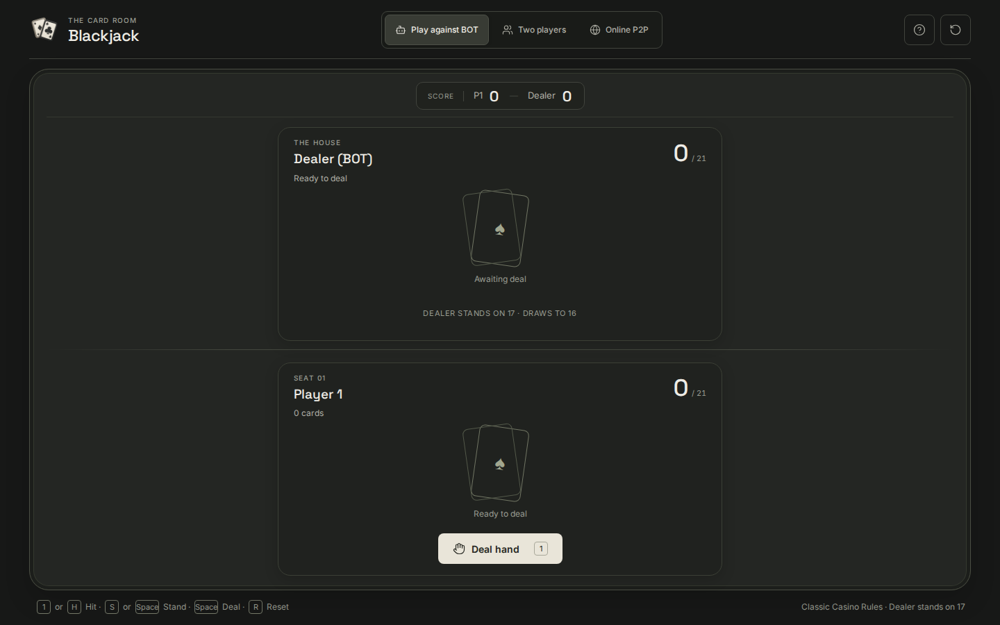
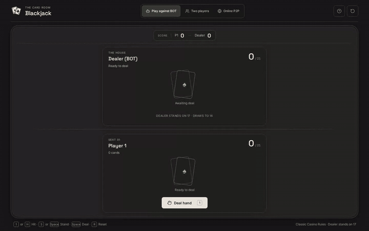

<p align="center">
  
</p>

<h1 align="center">Blackjack</h1>

<p align="center">
  A polished, browser-based 21 card game with local multiplayer and an optional automated opponent.
</p>

<p align="center">
  <a href="https://blackjack.leonemarcos.com/">
    
  </a>
  <a href="https://github.com/LeoneMarcos/blackjack/actions/workflows/ci.yml">
    
  </a>
  <a href="LICENSE">
    
  </a>
</p>

<p align="center">
  
  
  
  
  
</p>

<p align="center">
  <a href="#overview">Overview</a> ·
  <a href="#showcase">Showcase</a> ·
  <a href="#features">Features</a> ·
  <a href="#architecture">Architecture</a> ·
  <a href="#tech-stack">Tech Stack</a> ·
  <a href="#quick-start">Quick Start</a> ·
  <a href="#testing">Testing</a> ·
  <a href="#documentation">Documentation</a>
</p>

<p align="center">
  
</p>

---

## Overview

**Blackjack** is a lightweight 21 card game designed around a focused casino-style interface. Players can compete locally in a two-player mode or enable the BOT for an automated opponent, with the active game mode tracked through its own scoreboard.

The interface uses a continuous charcoal card table, ivory playing cards, restrained typography, Lucide icons, responsive layouts, and inline round feedback that keeps the game visible.

### Highlights

- **Two game modes** — Switch between local Player 1 vs Player 2 and Player 1 vs BOT matches.
- **Mode-specific scoreboards** — Local and BOT victories are tracked independently.
- **Responsive casino-style UI** — Neutral charcoal surfaces, ivory controls, animated cards, and responsive behavior.
- **Clear game feedback** — A subtle, temporary notification communicates wins, ties, and busts without blocking the table.

---

## Showcase

[](https://raw.githubusercontent.com/LeoneMarcos/blackjack/main/showcase-assets/blackjack-showcase.mp4)

The animated preview shows a short excerpt of bot play, local two-player mode, and round feedback. Open the full video below for the complete flow.

[](https://raw.githubusercontent.com/LeoneMarcos/blackjack/main/showcase-assets/blackjack-showcase.mp4)

---

## Features

- Full 52-card deck with suits, face cards, and shuffled dealing.
- 21-point scoring with flexible Ace values of 1 or 11.
- Local two-player mode with separate card controls.
- Optional BOT opponent with score-aware decision logic.
- Independent scoreboards for Player 2 and BOT matches.
- 30-second round timer with automatic round resolution.
- Temporary win, tie, and bust notifications.
- Game rules dialog with keyboard support through `Escape`.
- Keyboard controls: `1` for Player 1, `2` for Player 2 when the BOT is off, and `R` to reset scores.
- Responsive layout with a Blackjack favicon and Lucide interface icons.

---

## Architecture

The project is structured as a client-only single-page application built with React and TypeScript:

- **Presentation Layer (`src/App.tsx`)**: Controls visual hierarchy, header scoreboard, action triggers, rules dialog with keyboard trap/escape behavior, and accessible card labels.
- **State Machine & Reducer (`src/hooks/useBlackjackGame.ts`)**: Manages the game loop, active game mode (BOT vs Two-Player), turn states, independent scoreboards, and timed round expiration.
- **Domain Rules (`src/lib/deck.ts` and `src/lib/game-logic.ts`)**: Pure deck generation, card dealing, dynamic Ace valuation (1 or 11), and hand outcome comparison.
- **Styling (`src/index.css`)**: Dark casino theme tokens, responsive layouts, card tilt and deal animations, and mobile safe-area adaptations.

---

## Tech Stack

| Area | Technologies |
| --- | --- |
| Frontend | React 19, TypeScript 5.9 |
| Tooling | Vite 7 |
| Styling | Tailwind CSS 4 |
| Icons | Lucide React |
| Typography | Google Fonts: Inter and Space Grotesk |
| Testing | Vitest 3, Playwright 1.62 |
| Quality | ESLint 9, Prettier 3, TypeScript strict mode |
| CI | GitHub Actions |
| Validation | Production build validation with Vite |

---

## Quick Start

### Prerequisites

- Node.js 22 and npm (matching CI)

### 1. Clone the repository

```bash
git clone https://github.com/LeoneMarcos/blackjack.git
cd blackjack
```

### 2. Install dependencies

```bash
npm ci
```

### 3. Run locally

```bash
npm run dev
```

The application will be available at the local URL printed by Vite.

---

## Testing

Verified commands to test, lint, format-check, and build the project:

```bash
npm test
npm run lint
npm run typecheck
npm run format:check
npm run build
npm run test:e2e
```

The browser suite runs the critical BOT and local-player flows. To record the approved showcase flow locally, run `npm run showcase:prepare`; it starts Vite when needed, keeps the raw WebM, and produces a GitHub-compatible H.264 MP4. The **Publish Showcase** workflow performs the same capture in GitHub Actions and regenerates the canonical MP4, screenshots, and short README GIF preview when relevant product/showcase inputs change; it can also be run manually.

---

## Documentation

- [`ARCHITECTURE.md`](ARCHITECTURE.md) — System architecture and component roles.
- [`DESIGN.md`](DESIGN.md) — Visual styling tokens, UI behavior, and responsive contracts.
- [`PRODUCT.md`](PRODUCT.md) — Core game rules and product requirements.
- [`STACK.md`](STACK.md) — Technical stack constraints and tooling specifications.
- [`TEST_PLAN.md`](TEST_PLAN.md) — Test plan and validation strategy.
- [`docs/STATUS.md`](docs/STATUS.md) — Status log of checks, evidence, and pending items.

---

## License

This project is licensed under the **Apache License 2.0**. See [`LICENSE`](LICENSE) for details.
